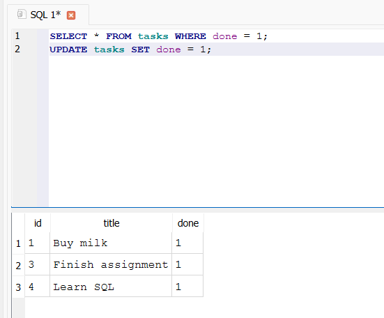
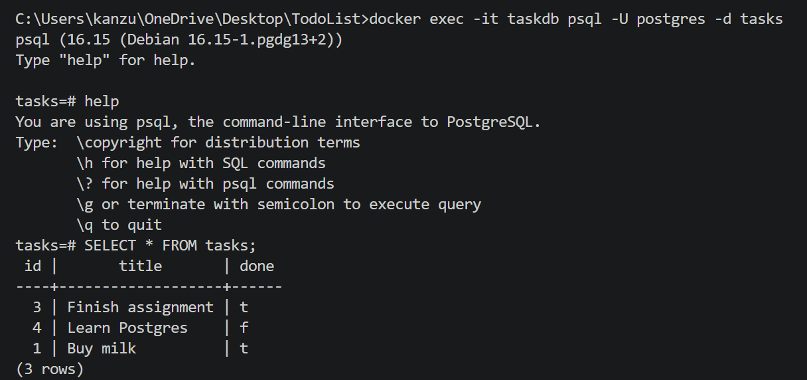

# Task API

A small CRUD API built with **Python + FastAPI** that manages a to-do list. Data is stored in a **PostgreSQL database running in Docker** — the whole stack (app + database) starts with a single command.

Built as part of the FlyRank Internship — Backend Track. Storage has evolved across three assignments:
- **Week 2 (A1)** — in-memory list
- **Week 3 (A2)** — SQLite file (`tasks.db`)
- **Week 1 (A3)** — containerized PostgreSQL via Docker Compose (current)

## How to run it

**One command, using Docker Compose:**

1. Clone this repo and go into the folder:
   ```bash
   git clone https://github.com/eman9099/TodoList.git
   cd TodoList
   ```

2. Copy the example environment file:
   ```bash
   cp .env.example .env
   ```

3. Start the whole stack (API + PostgreSQL):
   ```bash
   docker compose up
   ```

4. Open your browser:
   - API root: http://127.0.0.1:8000/
   - Interactive docs (Swagger UI): http://127.0.0.1:8000/docs

That's it — no Python install, no manual database setup. The `tasks` table and 3 example tasks are created automatically on first run.

To stop everything:
```bash
docker compose down
```
(Your data survives this — it's kept in a Docker volume. To wipe the data too, run `docker compose down -v`.)

## Endpoints

| Method | Path              | Description                        |
|--------|-------------------|-------------------------------------|
| GET    | `/`                | API info                           |
| GET    | `/health`          | Health check                       |
| GET    | `/tasks`           | List all tasks                     |
| GET    | `/tasks/{task_id}` | Get a single task by id            |
| POST   | `/tasks`           | Create a new task                  |
| PUT    | `/tasks/{task_id}` | Update a task's title and/or done  |
| DELETE | `/tasks/{task_id}` | Delete a task                      |

Each task has this shape:
```json
{ "id": 1, "title": "Buy milk", "done": false }
```

## Status codes

- `200` — successful read/update
- `201` — task created
- `204` — task deleted (no content returned)
- `400` — invalid input (e.g. missing/empty title)
- `404` — task not found

## Example: curl

Creating a task:
```bash
curl -i -X POST http://127.0.0.1:8000/tasks -H "Content-Type: application/json" -d "{\"title\":\"Buy milk\"}"
```

Response:
```
HTTP/1.1 201 Created
content-type: application/json

{"id":4,"title":"Buy milk","done":false}
```

## Swagger UI

The full CRUD cycle (create, read, update, delete) was tested using the interactive **Try it out** feature at `/docs`.


## Database (SQLite)

**Why SQLite?** It's a single file, needs zero setup or separate server, and is built into Python (`import sqlite3` — nothing to install). Perfect for a small project like this.

**Where the data lives:** `tasks.db`, created automatically the first time the app runs. The `tasks` table is created if it doesn't exist, and 3 example tasks are seeded only if the table is empty — restarting the server does not duplicate them or lose your data.

**Exploring it directly:** the database can be opened in [DB Browser for SQLite](https://sqlitebrowser.org/) to view and query the data outside the API.

Example query run in the "Execute SQL" tab:
```sql
UPDATE tasks SET done = 1;
```
This marked every task as done directly in the database. Calling `GET /tasks` right afterward (with no server restart) showed the change immediately — the API and DB Browser both read the same file, so there's no "syncing" step.



## Database (PostgreSQL in Docker)

**Why PostgreSQL + Docker?** SQLite (used in A2) is a single file — great for a small project, but it can't handle many programs writing to it at once, and it doesn't scale to real production traffic. PostgreSQL is a real database *server*, the same engine that powers most serious backends (FlyRank included). Docker lets us run it without installing Postgres directly on the machine — it's just a disposable, ready-made container that behaves identically on any computer, killing "works on my machine" problems.

**How the stack is wired:**
- `Dockerfile` builds the API into its own image.
- `compose.yaml` defines two services: `api` (the FastAPI app) and `db` (the official `postgres:16` image), and starts both together with `docker compose up`.
- A named volume (`taskdata`) keeps the database's files outside the container, so data survives a full `docker compose down` + `up` — proven by creating tasks, tearing the whole stack down, bringing it back up, and seeing the same tasks still there.
- The database password lives in `.env` (git-ignored) — never hardcoded. `.env.example` is committed with the same keys so anyone cloning the repo knows what to set.
- A healthcheck on the `db` service makes the `api` service wait until Postgres is actually ready to accept connections before starting, instead of just waiting for the container to exist.

**Exploring the database directly**, using `psql` inside the running container:
```bash
docker exec -it taskdb psql -U postgres -d tasks
```
Then, inside the SQL prompt:
```sql
SELECT * FROM tasks;
```



## Bonus Stage 6 (A2) — AI vs me: SQLite migration

I wrote my own spec from memory and asked an AI assistant to migrate the same API from in-memory storage to SQLite. The AI's version lives in `ai-version/main.py`, using its own database file (`ai_tasks.db`) so it never touches my real `tasks.db`.

### My prompt

> Migrate an existing FastAPI to-do task API from in-memory storage to SQLite. Use Python's built-in `sqlite3` module.
>
> The database file should be `tasks.db`, created automatically on startup. Create a `tasks` table if it doesn't already exist, with columns: `id` (integer primary key, autoincrement), `title` (text), `done` (integer, 0 or 1). Seed 3 example tasks only if the table is currently empty — restarting the app should never duplicate them.
>
> Keep these five endpoints with identical behavior to before:
> - `GET /tasks` — return all tasks from the database
> - `GET /tasks/{id}` — return one task; 404 with a JSON error if not found
> - `POST /tasks` — insert a new task; 400 if title is missing/empty; 201 with the created row (including the database-assigned id) on success
> - `PUT /tasks/{id}` — update title and/or done; 404 if not found, 400 if title is empty
> - `DELETE /tasks/{id}` — delete the task; 204 on success, 404 if not found
>
> Use parameterized queries (`?` placeholders) everywhere — never insert user input directly into SQL strings.

### Running it

I fired my Stage 2/3 checkpoints at the AI's version (running on port 8001): `GET /tasks` returned the 3 seeded tasks, `POST /tasks` created a 4th task (201), and after restarting the server the seed did **not** duplicate — still exactly 4 tasks, proving persistence worked correctly on the first try.

### What did the AI do better?

It used a Python `with sqlite3.connect(...)` block for every query instead of manually calling `get_db()` and `conn.close()` like I did — the connection closes automatically even if an error happens partway through, which is safer than remembering to close it by hand every time. It also converted `done` to a real `true`/`false` boolean in every response, while my API returns the raw `0`/`1` straight from SQLite.

### What did it get wrong or quietly ignore?

Nothing broke any requirement — all endpoints, status codes, and the seed-once rule worked correctly.

### What did my prompt forget to specify — and what did the AI decide for me?

- I didn't say how to structure the startup logic, so the AI used FastAPI's `lifespan` pattern (the newer recommended way to run startup code) instead of just calling `init_db()` at the top of the file like I did.
- I didn't specify the exact seed task titles, so the AI picked its own three examples instead of matching mine exactly.
- I didn't say whether `done` should be returned as `0`/`1` or `true`/`false` in the JSON response — the AI chose to convert it to a proper boolean.

### One rematch

For the second attempt, I added to my prompt: *"Return `done` as the raw integer stored in the database (0 or 1), not as a boolean."* The regenerated version then matched my original API's response shape exactly.

## Bonus Stage 7 — AI vs me

I wrote my own spec from memory (without looking back at the assignment doc) and asked an AI assistant to build the same API. The AI's code lives in `ai-version/` and was never mixed with my hand-built code.

### My prompt

> Build a to-do list REST API using Python and FastAPI. Data should be stored in memory (a Python list) — no database.
>
> Each task should have: `id` (integer), `title` (string), `done` (boolean, defaults to false).
>
> Endpoints needed:
> - `GET /tasks` — return all tasks
> - `GET /tasks/{id}` — return a single task; if not found, return 404 with a JSON error message
> - `POST /tasks` — create a new task from a `title` in the request body; return 201 with the created task; if title is missing or empty, return 400 with an error message
> - `PUT /tasks/{id}` — update a task's title and/or done status; return 404 if the id doesn't exist
> - `DELETE /tasks/{id}` — delete a task; return 204 with no body; return 404 if the id doesn't exist
>
> Also add `GET /` returning basic API info, and `GET /health` returning a status check.
>
> Automatically generate interactive Swagger UI documentation at `/docs`.

### Running it

I fired my Stage 4 checkpoint curls at the AI's version (running on port 8001) and every one passed: `GET /tasks`, `POST /tasks` (201), `GET /tasks/{id}` (200), `PUT /tasks/{id}` (200), `DELETE /tasks/{id}` (204), and validation on an empty title (400).

### What did the AI do better?

It used `response_model=Task` on every endpoint, so FastAPI validates the *response* shape too, not just the request. It also used readable constants like `status.HTTP_201_CREATED` instead of hardcoded numbers like `201` — makes the code easier to read at a glance. I understand both changes well enough to explain them, and I've started using `status.HTTP_xxx` in my own code too.

### What did it get wrong or quietly ignore?

Nothing was actually wrong — all my required behaviors were followed correctly. But it made a couple of silent decisions I didn't specify (see below).

### What did my prompt forget to specify — and what did the AI decide for me?

- I never said the list should start with example data, so the AI's version starts completely empty (`tasks_db = []`), while my version starts with 3 pre-filled tasks.
- I didn't specify the path parameter's name, so the AI used `id` while I had used `tasks_id`.
- I didn't specify how new ids should be generated, so the AI used a separate global counter (`current_id`) instead of computing `max(existing ids) + 1` like I did.

### One rematch

For the second attempt, I added to my prompt: *"Pre-fill the in-memory list with 3 example tasks on startup."* The regenerated version then started with 3 tasks instead of an empty list, matching my original API's behavior.