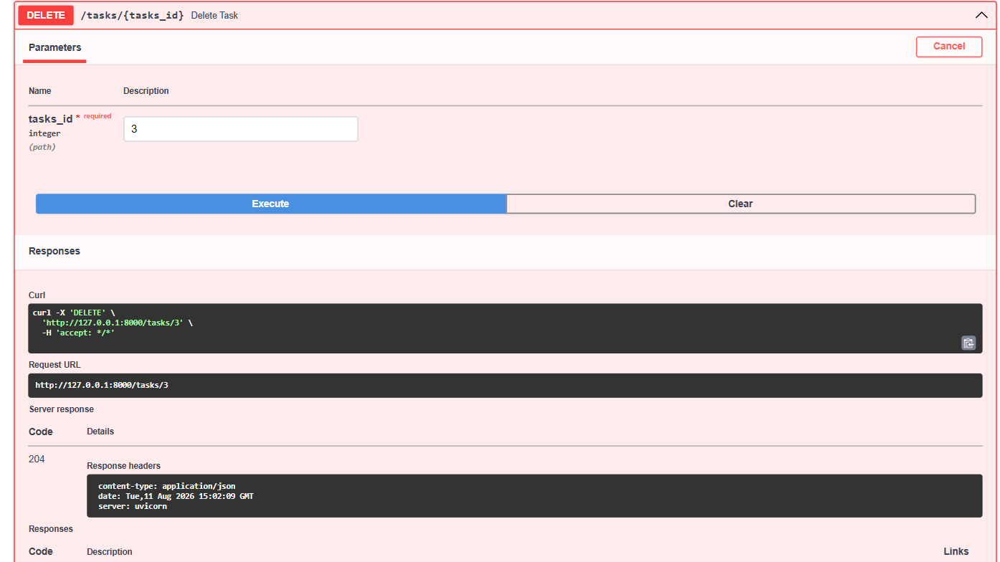
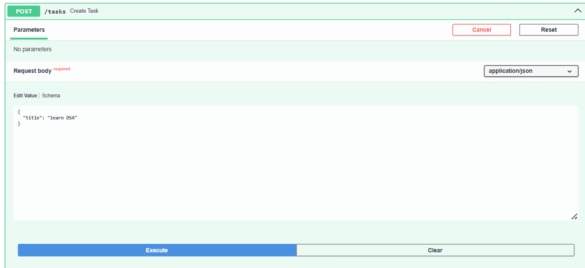
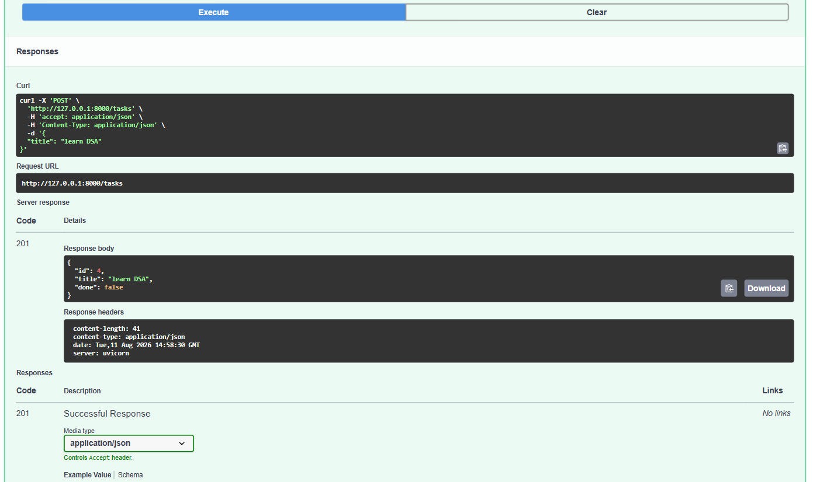
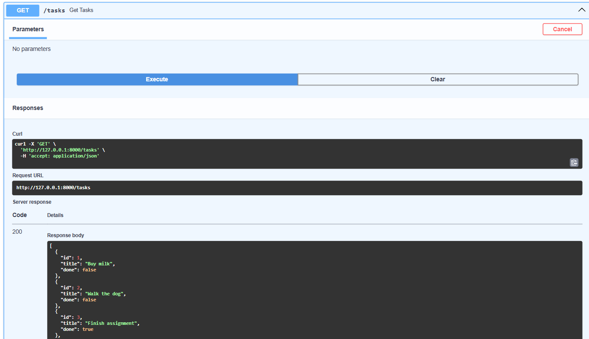
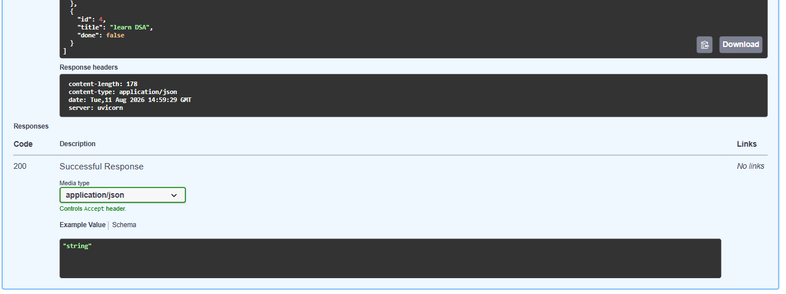

# Task API

A small CRUD API built with **Python + FastAPI** that manages a to-do list. Data is stored in memory (no database) — it resets whenever the server restarts.

Built as part of the FlyRank Internship — Backend Track, Week 2, Assignment A1.

## How to run it

1. Clone this repo and go into the folder:
   ```bash
   git clone https://github.com/eman9099/TodoList.git
   cd TodoList
   ```

2. (Optional but recommended) create and activate a virtual environment:
   ```bash
   python -m venv venv
   venv\Scripts\activate      # Windows
   source venv/bin/activate   # Mac/Linux
   ```

3. Install the dependencies:
   ```bash
   pip install fastapi uvicorn
   ```

4. Run the server:
   ```bash
   uvicorn main:app --reload
   ```

5. Open your browser:
   - API root: http://127.0.0.1:8000/
   - Interactive docs (Swagger UI): http://127.0.0.1:8000/docs

## Endpoints

| Method | Path              | Description                        |
|--------|-------------------|-------------------------------------|
| GET    | `/`                | API info                           |
| GET    | `/health`          | Health check                       |
| GET    | `/tasks`           | List all tasks                     |
| GET    | `/tasks/{task_id}` | Get a single task by id            |
| POST   | `/tasks`           | Create a new task                  |
| PUT    | `/tasks/{task_id}` | Update a task's title and/or done  |
| DELETE | `/tasks/{task_id}` | Delete a task                      |

Each task has this shape:
```json
{ "id": 1, "title": "Buy milk", "done": false }
```

## Status codes

- `200` — successful read/update
- `201` — task created
- `204` — task deleted (no content returned)
- `400` — invalid input (e.g. missing/empty title)
- `404` — task not found

## Example: curl

Creating a task:
```bash
curl -i -X POST http://127.0.0.1:8000/tasks -H "Content-Type: application/json" -d "{\"title\":\"Buy milk\"}"
```

Response:
```
HTTP/1.1 201 Created
content-type: application/json

{"id":4,"title":"Buy milk","done":false}
```

## Swagger UI

The full CRUD cycle (create, read, update, delete) was tested using the interactive **Try it out** feature at `/docs`.







## Notes on in-memory storage

Since tasks are stored in a plain Python list (not a database), restarting the server resets the list back to the 3 example tasks. This is expected — persistent storage is covered in a later assignment.
